#  CSCI 1103 Computer Science 1 Honors

## Fall 2022

Boston College

---

## Lecture Notes

## Week 15: Imperative Coding

**Topics:**

1. Storage Diagram Review
2. Understanding Imperative Control Features
3. The Case for and the Problem with Mutation
4. Exceptions

---

## 1. Storage Diagram Review

Several weeks ago we saw that the user space of a computer's ephemeral memory has a static part and a dynamic part.

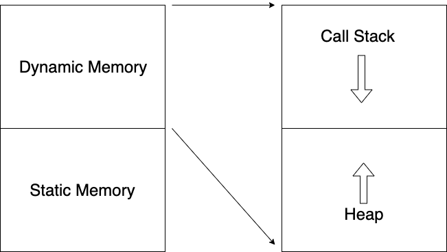

Among other things, Static Memory contains programs (or *images*) which, in the Unix environment, are a combination of machine instructions stored in a *text-segment* (a curious name) and storage for fixed-sized data (such as strings) known as a *data-segment*.

```
image = text-segment + data-segment
```

Dynamic Memory is "Dynamic" in the sense that it consists of two storage areas, the Call Stack and the Heap, that grow and shrink as a program executes. The Call Stack has storage for function variables and the Heap has storage for items that are too large to fit in one word of memory, e.g., tuples, lists, records and arrays.

> It's worth noting that the Simple Virtual Machine has no Dynamic Memory at all, it has neither a Call Stack nor a Heap.

#### Examples

```ocaml
let a = Array.make 4 5
```

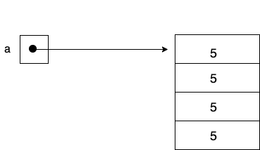

```ocaml
let b = [5; 5; 5; 5]  (* This is      5 :: (5 :: (5 :: (5 :: [])))       *)
```

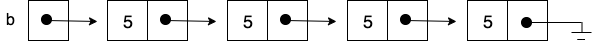


```ocaml
let c = Array.make_matrix 2 4 5
```

Logically, it's most convenient to think of the 2D array `c` as a table (left), but as far as storage goes, a 2D array is an array of arrays and is stored as on the right.

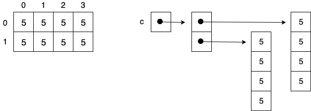

```ocaml
let d = Array.make 3 a
```

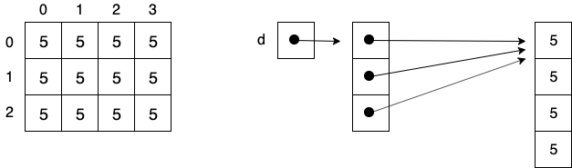

##### Append

```ocaml
let rec append xs ys =
  match xs with
  | [] -> ys                            (1)
  | z :: zs -> 
    let answer = z :: append zs ys
    in
    answer
  
append [1; 2] [3; 4]
```

Immediately after the initial call `append [1; 2] [3; 4]` but before the body is executed, the Stack and the Heap are as follows

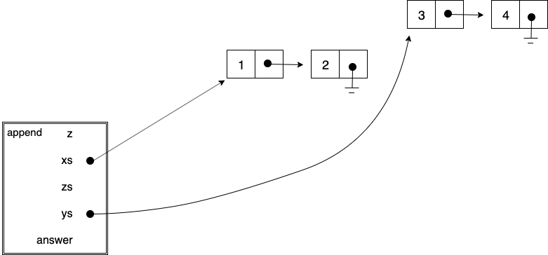

---

After two recursive calls, just before (1) is executed, the Stack and Heap are as follows

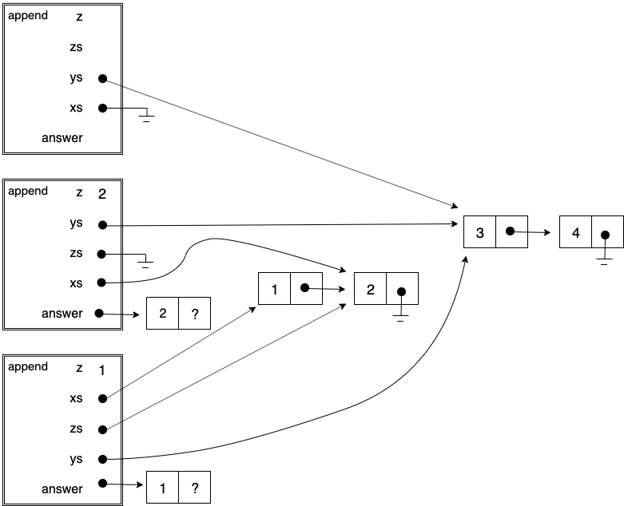

---

Just before the final `answer` is returned.

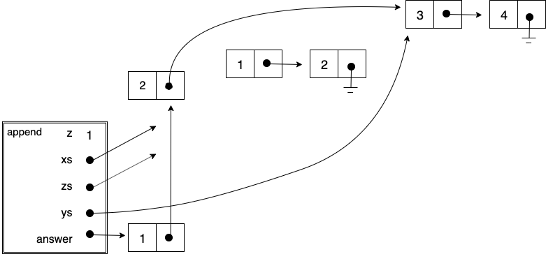

---

##### Shallow Copy & Deep Copy

```ocaml
let rec shallowCopy xs =
  match xs with
  | [] -> []
  | x :: xs -> x :: (shallowCopy xs)
  
let a = [(1, 2); (3, 4)]
let b = shallowCopy a
```

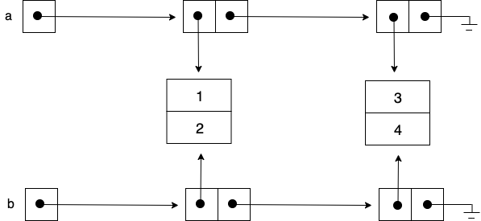

---

```ocaml
let copyPair (a, b) = (a, b)       (* Allocate a fresh pair! *)

let rec deepCopy xs =
  match xs with
  | [] -> []
  | x :: xs -> (copyPair x) :: (deepCopy xs)

let a = [(1, 2); (3, 4)]
let b = deepCopy a
```

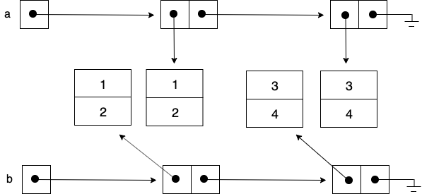


---

### 2. Understanding Imperative Control Features

In the first few weeks of the course we made our way through most of OCaml's expression features. In recent weeks we've been considering OCaml's imperative features, those that mimic the operation of the underlying machine. In particular, we've looked at

+ *Sequencing expressions*: `expr1; expr2; expr3`
+ *While-loops*: ```while expr1 do expr2 done```
+ *For-loops*: ```for i = expr1 to expr2 do expr3 done```

We'll look at each of these forms both from the low-level machine perspective, and also from the perspective of OCaml. In order to understand these features in terms of SVM we'll use the notation

```
... expr ...
```

to denote a sequence of SVM instructions that evaluate the expression `expr` leaving its value in `R0`.

##### Sequencing

We can understand `expr1; expr2; expr3` as `expr1; (expr2; expr3)`. That is, the sequence operator `;` associates to the right. We can understand `expr1; expr2` as the sequence of SVM instructions

```
... expr1 ...
... expr2 ...
```

The sequencing operator `;` can also be understood directly in OCaml as a simple `let`-expression.

```ocaml
let () = expr1 in expr2
```

Note that this requires `expr1` to be of type `unit`.

##### While-loop

The while-loop `while expr1 do expr2 done` can be understood as the following sequence of SVM instructions.

```
... expr1 ... <----+
CMP R0, Zero       |
BEQ o-----------+  |
... expr2 ...   |  |
JMP o-----------|--+
   <------------+
```

The while-loop `while expr1 do expr2 done` can also be understood as a simple recursive function.

```ocaml
let rec loop () =
  match expr1 with
  | true  -> expr2; loop ()        (* expr2 of type unit *)
  | false -> ()
in
loop ()
```

##### For-loop

The for-loop `for i = expr1 to expr2 do expr3 done` can be understood as the following sequence of SVM instructions.

```
... expr2 ...
MOV R2, R0
... expr1 ...
CMP R0, R2 <-------------------------+
BGT o-----------------------------+  |
... expr3 ...                     |  |
... reload loop index into R0 ... |  |
LI  R1, 1                         |  |
ADD R0, R0, R1                    |  |
JMP o-----------------------------|--+
   <------------------------------+
```

The for-loop can also be understood as a simple recursive function.

```ocaml
let n = expr2 in
let rec loop i =
  match i <= n with
  | true  -> expr3; loop (i + 1)       (* expr3 of type unit *)
  | false -> ()
in
loop expr1
```

---

### 3. The Case for and the Problem with Mutation

##### Generating Fresh Integers

There are innumerable coding applications where we want our code to remember *state* information. For example, we may want to generate a fresh integer for each user. We'd like a definition such as 

```ocaml
val fresh : unit -> int
```

such that when `fresh` is called, it returns a fresh integer.

```ocaml
# fresh ();;
- : int = 0

# fresh ();;
- : int = 1
```

It's worth noting that `fresh` is not a function -- a function has the property that if called with the same input, it always returns the same output. Our definition of `fresh` is a *procedure*. 

We can write `fresh` by having it remember the current count with a reference.

```ocaml
let fresh =
  let count = ref 0
  in
  (fun () ->
    let n = !count
    in
    count := n + 1;
    n)
```

##### Inserting and Removing Items from a Stateful List

As another application, consider inserting and removing items from a list. When we remove an item, we'd like to do so only once. We would like a mutable type and three procedures:

```ocaml
type 'a lst

val make   : unit -> 'a lst
val insert : 'a -> 'a lst -> unit
val remove : 'a lst -> 'a
```

For example, we want to write

```ocaml
let myList = make ();;
# insert 2 myList;;
- : unit = ()

insert 3 myList;;
- : unit = ()

# remove myList;;
- : int = 3

# remove myList;;
- : int = 2
```

Note that in addition to returning the removed item, the `remove` function modifies the list.

The type `a lst` and the three procedures `make`, `insert` and `remove` can be defined using mutable state as follows.

```ocaml
type 'a lst = 'a list ref

let make () = ref []
let insert x xs = xs := (x :: !xs);;
let remove xs = let x = (List.hd !xs) in xs := (List.tl !xs); x
```

##### The Cost of Unconstrained Mutation

Consider a simple example application working with points on the 2D plane. We might like to *reflect* a point over the diagonal line, y = x. We can do this simply by swapping the x and y components whenever x is greater than y. The type `point` and the `reflect` function can naturally be written as follows.

```ocaml
type point = { x : int
             ; y : int
             }

let reflect point =
  match point.x < point.y with
  | true  -> point
  | false -> { x = point.y
             ; y = point.x
             }
  
let point1 = {x = 2; y = 3}
let point2 = reflect point1

let _ = (Oslo.use point1, Shanghai.use point2)
```

In the code above, the author of `reflect` has decided to economize, saving two words of memory by returning the input point if the x and y fields are already in the right order. In this case, `point1` and `point2` are *aliases* -- they are different names for the same item in the Heap. 


The pair  `(Oslo.use point1, Shanghai.use point2)` exhibits the possibility of remote consumers of `point1` and `point2.` 

The author of `reflect` might instead opt to allocate a fresh point even though the `x` and `y` fields are already in order.

```ocaml
type point = { x : int
             ; y : int
             }

let reflect point =
  match point.x < point.y with 
  | true  -> { x = point.x                    (* This clause is different *)
             ; y = point.y
             }
  | false -> { x = point.y
             ; y = point.x
             }

let point1 = {x = 2; y = 3}
let point2 = reflect point1

let _ = (Oslo.use point1, Shanghai.use point2)
```

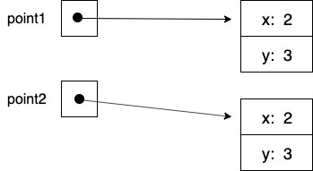

If points are immutable, aliasing presents no problem. In this case, the only difference between the two versions is that the non-alias version (the latter version) allocates two extra words of memory.

##### Aliasing with Mutation

On the other hand, if the `point` type was a *mutable* type

```ocaml
type point = { mutable x : int
             ; mutable y : int
             }
```

then there are serious consequences. In particular, with the aliasing code

```ocaml
let reflect point =
  match point.x < point.y with
  | true  -> point
  | false -> { x = point.y
             ; y = point.x
             }
```

there is a hidden dependency between the author's code and the code `Oslo.use` and `Shanghai.use`. If `Oslo.use` were to mutate one of the fields of `point1`, the effect would also occur in `point2` used in `Shanghai.use` -- they refer to the same item in the Heap. (And similarly if `Shanghai.use` were to mutate one of the fields of `point2`.) The combination of aliasing and mutation admits or fosters an especially insidious class of program bugs that are exceedingly difficult to track down. Note that if the author of `reflect` spontaneously decided to switch from one implementation to the other, it would silently impact these other groups.

The culprit here is neither aliasing nor mutation, it is the combination of aliasing with unconstrained mutation.

---

### 4. Exceptions

When unusual circumstances occur during program execution, e.g., attempting to open a file that doesn't exist, control flow can be altered to allow for some sort of recovery. The mechanism, *exceptions*, are available in most modern programming languages. Consider the following simple code.

```ocaml
let three trigger =
  print_endline "Entered three";
  print_endline "Exiting three"
  
let two trigger =
  print_endline "Entered two";
  three trigger;  
  print_endline "Exiting two"

let one trigger =
  print_endline "Entered one";
  two trigger;
  print_endline "Exiting one"
```

Running this code with the call `one false` would produce

```ocaml
Entered one
Entered two
Entered three
Exiting three
Exiting two
Exiting one
```

However, if we are concerned that something may go wrong during the execution of `two` or something it might call, we can embed our call to `two` in an exception handler.

```ocaml
exception Show of int

let three trigger =
  print_endline "Entered three";
  if trigger then raise (Show 5) else ();
  print_endline "Exiting three"

let two trigger =
  print_endline "Entered two";
  three trigger;  
  print_endline "Exiting two"

let one trigger =
  print_endline "Entered one";
  (try
    two trigger
   with 
   | Show n -> Code.pfmt "In one, caught Show(%d) exception\n" n);
  print_endline "Exiting one"
```

Running this code with `one true` would produce

```ocaml
Entered one
Entered two
Entered three
In one, caught Show(5) exception
Exiting one
```

Control has skipped over the remainder of both `three` and `two`, returning directly to the exception handler in `one`.  The call stack has been *unwound* to the point with the nearest handler for the `Show` exception.
